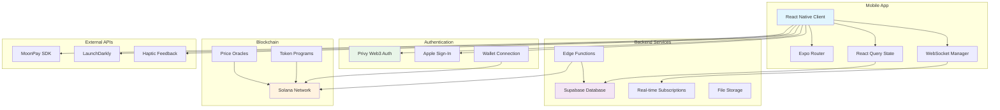
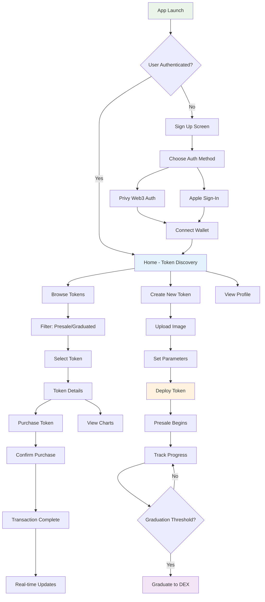
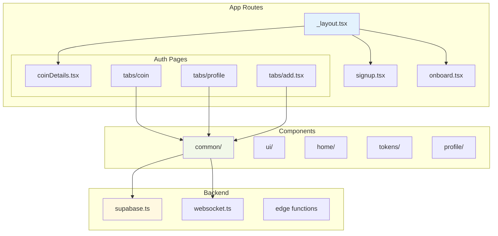
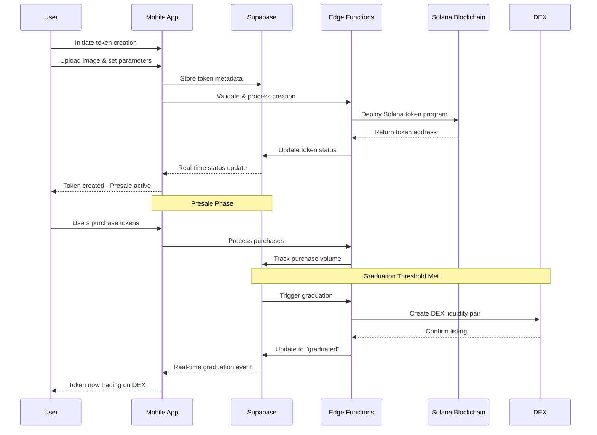
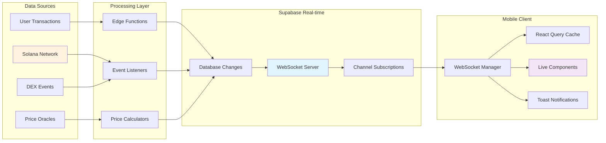

# pump.fun Clone


A high-performance mobile implementation of the pump.fun protocol built with React Native and Expo. This app enables users to create, discover, and trade meme tokens with real-time price tracking and decentralized token creation capabilities.

## System Architecture



## Technical Implementation

### Protocol Stack
- **Blockchain Layer:** Solana blockchain integration
- **Smart Contracts:** Solana programs
- **State Management:** React Query with real-time WebSocket subscriptions
- **Database:** Supabase (PostgreSQL) with real-time capabilities
- **Mobile Framework:** React Native (Expo 52) with App Router
- **Authentication:** Privy Web3 auth + Apple Sign-In
- **Styling:** NativeWind (Tailwind CSS for React Native)

### Core Features
- **Token Creation:** Create new meme tokens with custom branding
- **Token Discovery:** Browse trending and presale tokens with real-time updates
- **Trading:** Purchase tokens in presale phase with graduation to DEX
- **Real-time Updates:** WebSocket integration for live price feeds
- **Wallet Integration:** Solana wallet management with Privy authentication
- **Charts & Analytics:** Token price visualization and metrics

```typescript
interface TokenData {
  name: string;
  symbol: string;
  imageUrl: string;
  description: string;
  
  // Trading data
  currentPrice: number;
  marketCap: number;
  volume24h: number;
  isPresale: boolean;
  
  // Protocol extensions
  tradingEnabled: boolean;
  graduationThreshold: number;
}

interface WebSocketMessage {
  solAmount: number;
  mint: string;
  traderPublicKey?: string;
  maker?: string;
  market?: string;
}
```

### User Journey Flow



### Performance Metrics
| Operation | Latency | Throughput |
|-----------|---------|------------|
| Price Updates | <100ms | 10/sec |
| Token Creation | ~15sec | 5/min |
| Order Execution | <2sec | 30/min |

## Development Setup

### 🔑 Key Commands
- **Dev Client Build:** `npm run dev-client` - Create dev-client build for physical device
- **Development Server:** `npm run dev` - Serve code for existing dev-client  
- **Install Dependencies:** `npm install`

### 🌲 Environment Variables
- `EXPO_PUBLIC_APP_VARIANT="development"` (for local development)
- No environment variables required for production app builds

### 🏃 Running Locally
1. Navigate to root directory
2. `npm install`
3. `npm run dev-client` to create dev-client build
4. Scan QR code to open on device
5. For subsequent runs (if no native changes): `npm run dev`

### 🧑‍💻 Supabase Edge Functions (Local)
1. Open Docker app
2. Navigate to `supabase/functions` and create `.env`:
   ```
   IS_LOCAL=true
   URL="https://ebaqrryrinmxanbidylq.supabase.co"
   SERVICE_ROLE_KEY=<SUPABASE_SERVICE_ROLE_KEY>
   ```
3. Run `supabase start` from `supabase/` directory
4. Run `supabase functions serve`

## Technical Architecture

### Mobile Client
- **Framework:** Expo App Router (React Native 0.76.7)
- **State Layer:** React Query (@tanstack/react-query) with WebSocket integration
- **UI Components:** Custom haptic-enabled components with NativeWind styling
- **Authentication:** Privy Web3 authentication + Apple Sign-In
- **Navigation:** File-based routing with Expo Router

### Backend Infrastructure
- **Core:** Supabase with Edge Functions (Deno runtime)
- **Database:** PostgreSQL with real-time subscriptions via WebSocket
- **Blockchain:** Solana Web3.js integration
- **Features:** LaunchDarkly feature flags
- **Payments:** MoonPay SDK integration

### App Organization



**Directory Structure:**
```
app/                    # Expo Router pages
├── _layout.tsx        # Root layout with providers
├── signup.tsx         # User onboarding
├── (auth)/           # Authenticated routes
│   ├── [coinDetails].tsx  # Token detail screen
│   └── (tabs)/       # Tab navigation
│       ├── (coin)/   # Token discovery & trading
│       ├── (profile)/ # User profile
│       └── add.tsx   # Create new token

components/            # Reusable UI components
├── common/           # Business logic components
├── ui/              # Base UI components
└── (feature)/       # Feature-specific components

utils/               # Utilities & integrations
├── supabase.ts     # Database client
├── websocket.ts    # Real-time connections
└── storage.ts      # Local storage

supabase/           # Backend functions
├── functions/      # Edge functions
└── migrations/     # Database schema
```

### ⚙️ Reusable Components
- **ParentView:** Main view wrapper for pages
- **CText:** Standardized text with custom fonts
- **CTextInput:** Consistent text input styling
- **Icon:** Lucide icons integration
- **Spacer:** Layout spacing utility
- **CustomHaptics:** Consistent haptic feedback

## Protocol Specifications

### Token Creation Flow



### Real-time Features



**Features:**
- WebSocket subscriptions for live token updates
- Real-time price feeds via Supabase realtime
- Live purchase notifications and toasts
- Token discovery with instant updates

*Made with ❤️ and lots of boba 🧋*