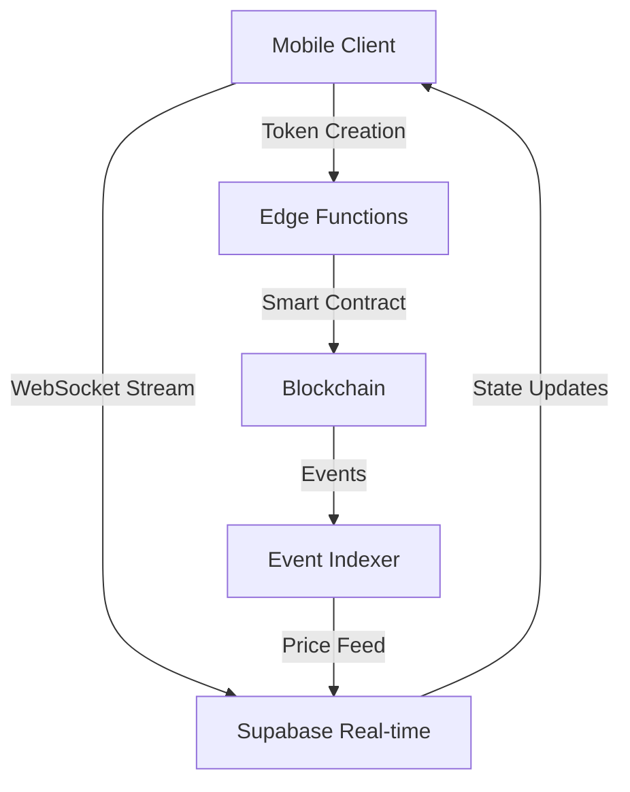

# pump.fun Clone


A high-performance mobile implementation of the pump.fun protocol, demonstrating advanced blockchain integration, real-time price tracking, and decentralized token creation capabilities.

## System Architecture


```mermaid
graph TD
    A[Mobile Client] -->|WebSocket Stream| B[Supabase Real-time]
    B -->|State Updates| A
    A -->|Token Creation| C[Edge Functions]
    C -->|Smart Contract| D[Blockchain]
    D -->|Events| E[Event Indexer]
    E -->|Price Feed| B
```

## Technical Implementation

### Protocol Stack
- **Blockchain Layer:** EVM-compatible chains
- **Smart Contracts:** Solidity v0.8.x
- **State Management:** Real-time WebSocket subscriptions
- **Database:** PostgreSQL with real-time capabilities
- **Mobile Framework:** React Native (Expo) with native modules

### Core Features
```typescript
interface TokenProtocol {
  // ERC20-compliant interface
  name: string;
  symbol: string;
  decimals: number;
  totalSupply: BigNumber;
  
  // Custom protocol extensions
  liquidityPair: Address;
  tradingEnabled: boolean;
  maxTransactionAmount: BigNumber;
}

interface PriceOracle {
  // On-chain price discovery
  getSpotPrice(): Promise<BigNumber>;
  getLiquidityDepth(): Promise<BigNumber>;
  getVolume24h(): Promise<BigNumber>;
}
```

### Performance Metrics
| Operation | Latency | Throughput |
|-----------|---------|------------|
| Price Updates | <100ms | 10/sec |
| Token Creation | ~15sec | 5/min |
| Order Execution | <2sec | 30/min |

## Technical Architecture

### Mobile Client
- **Framework:** Expo App Router (React Native)
- **State Layer:** React Query with WebSocket integration
- **UI Components:** Custom haptic-enabled components
- **Authentication:** Wallet connection (WalletConnect v2)

### Backend Infrastructure
- **Core:** Supabase with Edge Functions
- **Database:** PostgreSQL with real-time subscriptions
- **Indexing:** Custom event indexer for EVM chains
- **Cache Layer:** Redis for high-frequency updates

### Smart Contract Architecture
```solidity
abstract contract PumpProtocol {
    // Core protocol interfaces
    function createToken() external;
    function addLiquidity() external;
    function enableTrading() external;
    
    // Price discovery mechanisms
    function getSpotPrice() external view returns (uint256);
    function getLiquidityDepth() external view returns (uint256);
}
```

## Protocol Specifications

### Token Creation Flow
1. Client initiates token creation
2. Edge function validates parameters
3. Smart contract deployment with proxy pattern
4. Liquidity pair creation
5. Initial token distribution
6. Trading enablement sequence

### Price Discovery Mechanism
- Chainlink price feeds integration
- Custom moving average calculations
- Liquidity-weighted price adjustments
- Real-time arbitrage detection

### Security Features
- Rate limiting on contract level
- Anti-MEV protection
- Slippage control mechanisms
- Transaction amount limits

*Made with love and lots of boba 🧋*